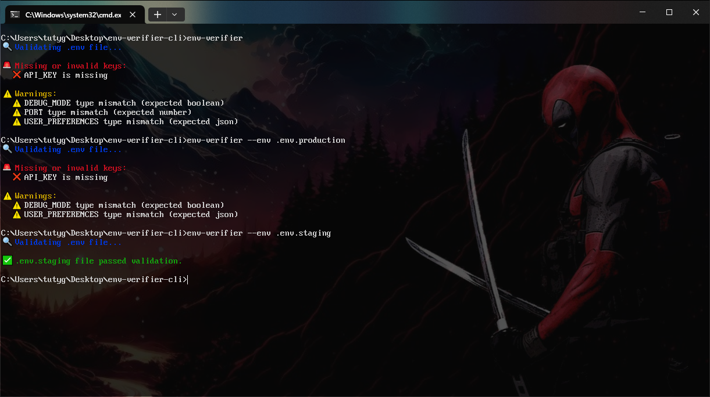

<p align="center"><a href="https://nodei.co/npm/env-verifier-cli/"></a></a></p>
<p align="center">
  
</p>

# 🛡️ env-checker-cli

A lightweight and powerful CLI tool to validate your `.env` files against a defined schema.
Very easy to configure with minimal setup.

<div align="center">
    
</div>

# 🚀 Features

Validate `.env` files for:
  - ❗ Missing or invalid required keys
  - ⚠️ Unused keys not defined in your schema
  - 🧪 Type checking: `string`, `number`, `boolean`, `array`, `JSON (object)`, `Object`, [Date](https://date-fns.org/docs/Getting-Started/)
  - 🧩 Support for optional keys, allowing flexible configurations
  - 🔁 Works with multiple `.env` files (e.g., `.env.production`, `.env.staging`, `.env.test`) and supports type-specific validation for each
  - 🛠️ Customizable schema for defining required and optional keys with specific types (string, number, boolean, array, JSON)
  - 🌍 Multi-environment support with easy-to-understand validation for complex configurations

# 📦 Installation

Global:

```bash
npm install -g env-checker-cli
```

Local (as dev dependency):
```bash
npm install --save-dev env-checker-cli
```

# 👨‍💻 Usage

```bash
env-checker --env .env --schema env.schema.json
```

Or

```bash
env-checker --env .env.staging --schema env.schema.json
```

Or for different folder paths

```bash
env-verifier --env %USERPROFILE%\Downloads\.env --schema %USERPROFILE%\Downloads\env.schema.json
env-verifier --env $HOME/Downloads/.env --schema $HOME/Downloads/env.schema.json
env-verifier --env ~/Downloads/.env --schema ~/Downloads/env.schema.json
```

## Options:

```bash
--env     Path to the .env file to validate        (default: .env)
--schema  Path to the schema JSON file             (default: env.schema.json)
```

# 📂 Example (for more details see `env.schema.json`)

`.env` file:
```json
API_KEY=abc123
DEBUG_MODE=true
PORT=3000
```

`env.schema.json` file:
```json
{
    "REQUIRED_KEYS": {
        "API_KEY": "string",
        "DEBUG_MODE": "boolean"
    },

    "OPTIONAL_KEYS": {
        "PORT": "number"
    }
}
```

# 🧩 Supported Types

- **string** → `my-api-key`, `https://example.com`, `debug`
- **number** → `3000`, `42`, `3.14`
- **boolean** → `true`, `false`
- **array** → `["https://myapp.com", "https://admin.myapp.com"]`, `["feature1", "feature2", "feature3"]`
- **JSON (object)** → `{"theme": "dark", "notifications": true}`, `{"maxRetries": 3, "timeout": 5000}`
- **date** → `2025-01-01`, `2023-05-01T15:30:00Z`

# 🔐 FAQ

Don't worry, the `.env` files provided in this repository contain dummy data only.
